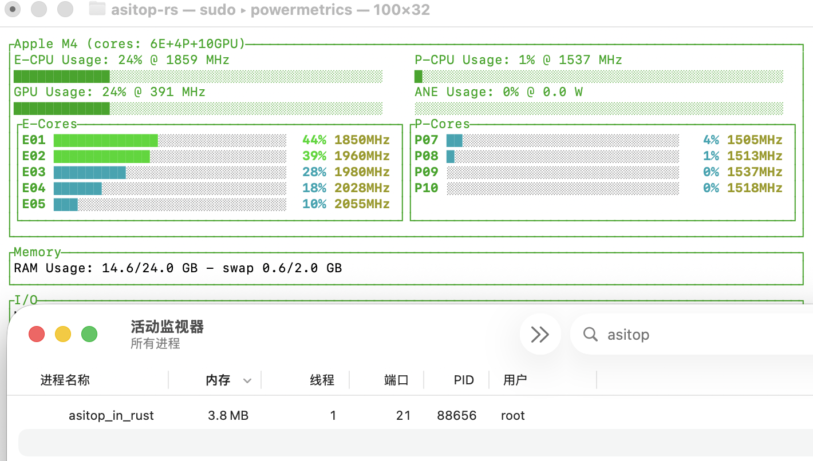
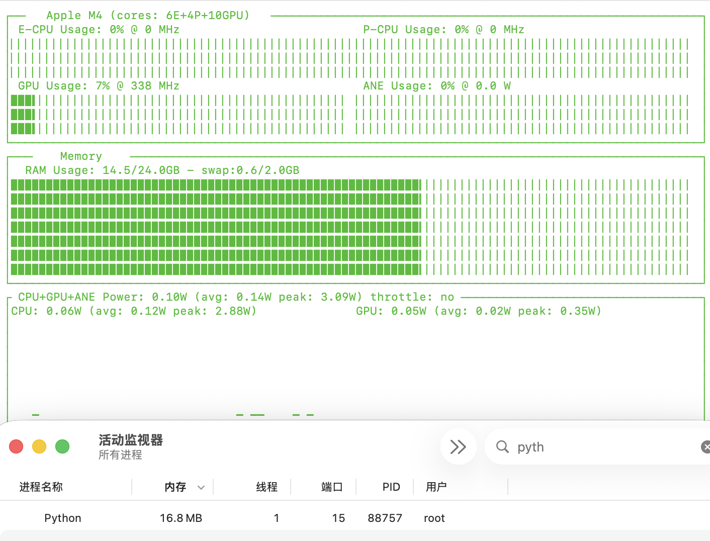
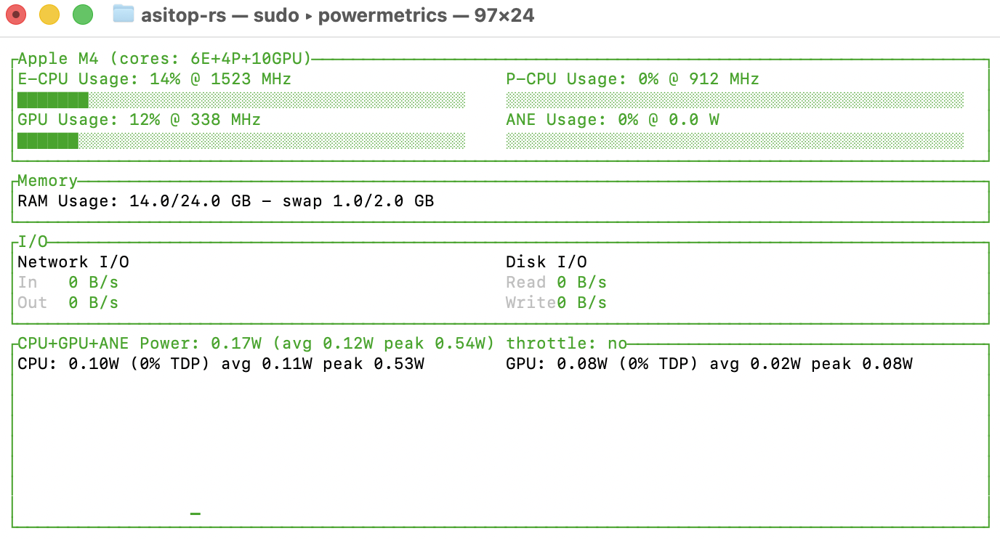

# asitop In Rust
## [English Version](./Doc/README_EN.md)

这是原 [asitop](https://github.com/tlkh/asitop) 的 Rust 重构版本。采用 Ratatui UI 构建UI，同时 Rust 版本修复了原 Python 版本存在的内存泄漏问题(详见原仓库 Issue [#80](https://github.com/tlkh/asitop/issues/80))，并将长时间运行的内存占用降至4MB左右，约**原asitop短时运行的 25%**。
## Rust版本内存占用，3.8MB

## Python版本内存占用 16.8MB

我曾在一个周末连续运行两天原版 asitop，内存泄漏直接让 swap 写满了我的 512 GB 硬盘。
## 预览图



开启 `--show-cores` 参数后的单核视图：


## 功能特性

- 展示 CPU（集群 + 单核）、GPU、ANE 的块状占用条与功耗信息，支持滚动平均与峰值跟踪。
- 提供内存、交换分区、当前功耗、平均功耗、峰值功耗、网络与磁盘 I/O 速率等系统状态概览。
- 支持自定义刷新间隔、CPU&GPU功耗滚动平均窗口、配色方案，以及可选的单核视图与自动重启 `powermetrics`。
- UI布局可根据终端窗口大小自适应

## 自行构建

```bash
cd asitop_InRust
cargo build --release
```

可执行文件位于 `target/release/asitop_in_rust`。
### 安装

```bash
cargo install --path .
```

## 使用

`powermetrics` 需要 `sudo` 才能读取硬件计数器，运行示例：

```bash
sudo target/release/asitop_in_rust --interval 2 --avg 30 --color 2  --show-cores
```

### 参数

- `--interval <seconds>`：刷新频率，同时也是 `powermetrics` 的采样间隔。
- `--avg <seconds>`：功耗读数的滚动平均窗口。
- `--color <0-8>`：选择预设配色。

  | 值 | 配色    |
  |----|--------|
  |  0 | Black  |
  |  1 | Red    |
  |  2 | Green  |
  |  3 | Yellow |
  |  4 | Blue   |
  |  5 | Magenta|
  |  6 | Cyan   |
  |  7 | White  |
  |  8 | LightMagenta |

  默认值：`Green`
- `--show-cores`：开启单核视图。
- `--max-count <n>`：采样达到 `n` 次后自动重启 `powermetrics`（0 表示永不重启）。
默认参数:
--interval 2 --avg 30 --color 1
按下 `q`、`Esc` 或 `Ctrl+C` 即可退出界面。
